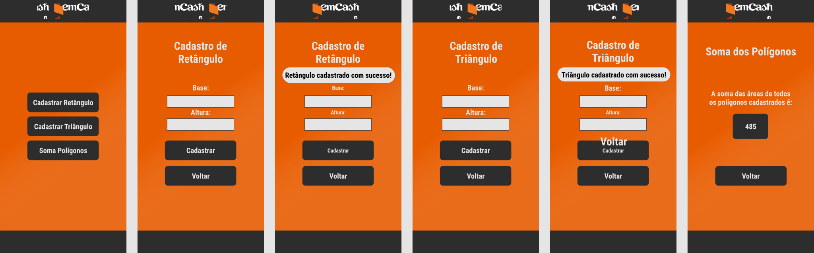

# App

> Aplicativo feito com React Native. Disponível na Google Play para testes. 

  

## Features Utilizadas:

* "axios": "^0.19.0",
* "prop-types": "^15.7.2",
* "react-native-gesture-handler": "^1.4.1",
* "react-navigation": "^4.0.4",
* "react-navigation-stack": "^1.7.3",
* "styled-components": "^4.3.2"

> Iniciei o projeto com react-native init

> Logo após, instalei o app com react-native run-android

> Executei o emulador com react-native start

> Instalei as dependências (axios, react-navigation, styled-components, react-navigation-gesture-handler)